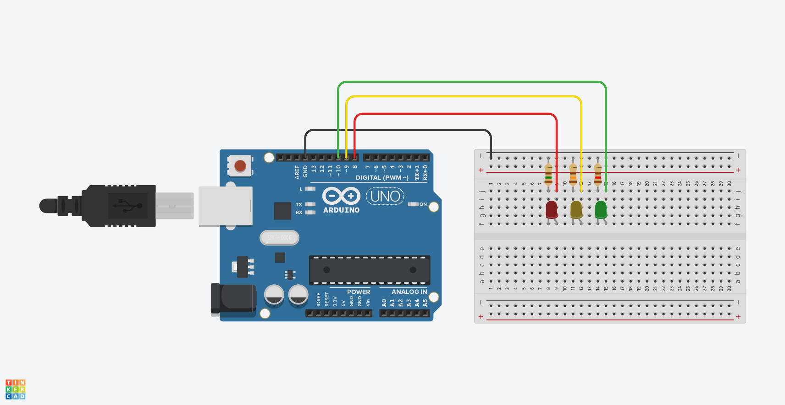

# Clase 1 · Introducción a Arduino y Placas Afines

**Curso:** Aplicaciones Tecnológicas en Artes Mediales
**Duración:** 1 sesión (~105 min)
**Público:** Estudiantes con poca o nula experiencia previa
**Placas objetivo:** Arduino UNO R3/R4 WiFi, Arduino Zero, Arduino 101, ESP32, ESP8266 (NodeMCU)

---

## 🎯 Resultados de aprendizaje

Al finalizar la clase, podrás:

1. Identificar pines **digitales**, **analógicos** y líneas de **GND/3.3V/5V** en distintas placas.
2. Explicar conceptos clave del **glosario** (bits, I2C, SPI, RX/TX, USB, Ley de Ohm, Arduino IDE, etc.).
3. Cablear y programar **tres LEDs** en Arduino usando pines digitales.
4. Plantear el diseño de un **semáforo vial + peatonal** como ejercicio aplicado.

---

## 📦 Materiales

* 1 × Arduino (UNO/UNO R4 WiFi recomendado) o ESP32/ESP8266
* 1 × Cable USB (según placa)
* 1 × Protoboard
* 3 × LEDs (rojo, amarillo, verde)
* 3 × Resistencias **150, 130 y 120 Ω** (limitadoras de corriente)
* Jumpers (M–M)
* **Opcional (tarea):** 1 LED rojo peatonal + 1 LED verde peatonal + 2 resistencias 150–120 Ω + 1 pulsador (si implementas botón de cruce)

> **Nota de voltajes**
>
> * UNO/R3/R4: lógica a **5V**.
> * Zero/101/ESP32/ESP8266: lógica a **3.3V** (evitar conectar señales de 5V a pines de 3.3V).

---

## 🧠 Glosario esencial

### Puertos Analógicos

Entradas que leen valores **variables** (no solo 0/1). En Arduino UNO: A0–A5 (resolución típica **10 bits** → 0–1023). Útiles para potenciómetros y sensores analógicos.

### Puertos Digitales

Pines que pueden ser **entrada/salida** con dos estados: **HIGH (1)** / **LOW (0)**. En Arduino UNO: D0–D13. Algunos admiten **PWM** (simulan salida analógica por modulación).

### Bits

Unidad mínima de información (**0 o 1**). 10 bits ⇒ **1024** estados posibles (0–1023). Más bits ⇒ mayor resolución/rango.

### USB (Universal Serial Bus)

Interfaz para **alimentar** y **programar** la placa desde el computador. En general entrega **5V** desde el host.

### RX / TX (Serial)

Líneas para comunicación serial: **RX** (recibe), **TX** (transmite). Usadas por el puerto serial y el **Monitor Serial** del IDE.

### I²C (Inter‑Integrated Circuit)

Protocolo de dos hilos: **SDA** (datos) y **SCL** (reloj). Permite múltiples dispositivos en el mismo bus (cada uno con dirección). Útil para sensores y pantallas OLED.

### SPI (Serial Peripheral Interface)

Protocolo rápido con líneas **MISO**, **MOSI**, **SCK** y **CS/SS**. Común en **lectores MicroSD**, **pantallas TFT** y radios.

### 3V / 3.3V

Linea de **3.3 voltios**. Tensión de lógica nativa en **Zero/101/ESP32/ESP8266**. No aplicar 5V directo a pines de 3.3V.

### 5V

Linea de **5 voltios**. Lógica nativa de **Arduino UNO/R3/R4**. Apta para muchos módulos “5V‑tolerant”.

### GND (Ground)

**Tierra común**. Referencia eléctrica del circuito. **Todo** dispositivo conectado debe compartir GND para lecturas estables.

### Ley de Ohm

Relación entre **voltaje (V)**, **corriente (I)** y **resistencia (R)**:
**V = I × R** (y por tanto **I = V/R**, **R = V/I**).
Ejemplo: Para un LED con caída ~2V alimentado a 5V, queremos **I ≈ 10–15 mA**. Resistencia ≈ (5V − 2V) / 0.015A ≈ **200 Ω** → usamos **220–330 Ω**.

### Arduino IDE

Entorno de Desarrollo Integrado para **escribir**, **compilar** y **subir** programas (“sketches”) a placas Arduino (y compatibles). Incluye el **Monitor Serial** y gestión de **placas/librerías**.

---

## 🧪 Bloque 1 (45 min): Mini‑demostración y glosario aplicado

1. Identificación rápida de pines en la placa (digitales/analógicos, 3.3V/5V, GND).
2. Explicación breve del glosario con ejemplos físicos en la protoboard.
3. Preguntas cortas de chequeo (p. ej., ¿qué pasa si no compartimos GND?).

---

## 🔧 Bloque 2 (30 min): Encender **tres LEDs** con pines digitales

### Cableado sugerido (Arduino UNO)

* **D2 →** resistencia 220–330 Ω → **LED Verde** → **GND**
* **D3 →** resistencia 220–330 Ω → **LED Amarillo** → **GND**
* **D4 →** resistencia 220–330 Ω → **LED Rojo** → **GND**

> En ESP32/ESP8266 usa pines GPIO disponibles (evita pines reservados para flash/boot si no los conoces). Asegura **GND común**.

### Código de ejemplo (3 LEDs)

```cpp
// Tres LEDs en D2, D3, D4 (Arduino UNO/R3/R4). Ajusta pines si usas otra placa.
const int LED_VERDE   = 2;
const int LED_AMARILLO= 3;
const int LED_ROJO    = 4;

void setup() {
  pinMode(LED_VERDE, OUTPUT);
  pinMode(LED_AMARILLO, OUTPUT);
  pinMode(LED_ROJO, OUTPUT);
}

void loop() {
  digitalWrite(LED_VERDE, HIGH);
  digitalWrite(LED_AMARILLO, LOW);
  digitalWrite(LED_ROJO, LOW);
  delay(800);

  digitalWrite(LED_VERDE, LOW);
  digitalWrite(LED_AMARILLO, HIGH);
  delay(400);

  digitalWrite(LED_AMARILLO, LOW);
  digitalWrite(LED_ROJO, HIGH);
  delay(800);
}
```

**Objetivo:** comprender relación **pin físico ↔ instrucción digital** y uso de resistencias según **Ley de Ohm**.

---

## 🧭 Tarea (30–60 min fuera de clase): Semáforo **vial + peatonal**



### Requerimientos mínimos

* Semáforo vehicular: **Rojo, Amarillo, Verde** (3 LEDs).
* Semáforo peatonal: **Rojo, Verde** (2 LEDs).
* Secuencia coherente:

  * Vehicular **Verde → Amarillo → Rojo**.
  * Peatonal **Rojo** cuando vehicular **Verde/Amarillo**; peatonal **Verde** cuando vehicular **Rojo**.
* **Duraciones** (sugerencia, puedes modificarlas):

  * Vehicular: Verde 4s, Amarillo 1s, Rojo 4s.
  * Peatonal: Verde 4s (intermitente los últimos 1–2s si quieres extender).
* **Extra (opcional):** Pulsador para solicitar cruce peatonal.

> **Desafío opcional:** añadir parpadeo del **peatonal verde** al final del cruce, y un **botón** para solicitar paso peatonal que altere el ciclo cuando sea seguro.

---

## 🧰 Solución de problemas (FAQ)

* **LED no enciende:** verifica orientación (ánodo a la resistencia/pin, cátodo a GND) y continuidad de la protoboard.
* **Todos los LEDs encendidos débilmente:** falta **GND común**.
* **Led de ilumina poco:** revisa la cantidad de Ohms de la **resistencia** (150Ω, 130Ω y 120Ω Ohms) y si está en **kΩ** el LED tendrá muy poca iluminación.
* **Calentamiento o mal olor:** desconecta; revisa cortos y resistencias adecuadas (Ley de Ohm).
