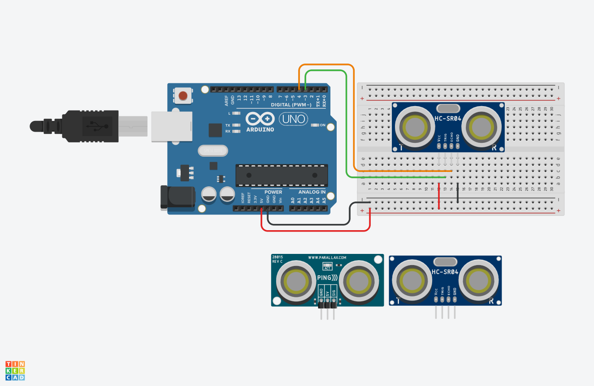

# 📘 Clase 3 — Sensores de Distancia en Arduino 
### Continuación de clase #2

---

## 🎯 Objetivos de la clase

- Comprender el funcionamiento de los **sensores de distancia** por ultrasonido e infrarrojo.  
- Programar la lectura de distancias mediante **HC-SR04** (ultrasonido) y **SHARP GP2Y0A21/GP2Y0A02** (IR).  
- Analizar la estructura del código y los elementos del lenguaje Arduino (constantes, variables, tipos de datos, comunicación serial).  
- Preparar la integración de sensores con **controladores MIDI** y **Sonic Pi**.

---

## 🧠 Introducción



Los sensores de distancia permiten medir la **proximidad de objetos** utilizando diferentes principios físicos.  
- El **HC-SR04** mide distancia mediante **ondas ultrasónicas**: envía un pulso y mide el tiempo que tarda en regresar el eco.  
- Los **SHARP GP2Y0A21 / GP2Y0A02** utilizan **infrarrojos**: emiten un haz de luz y calculan la distancia a partir del reflejo.

En esta clase trabajaremos con ambos, comenzando por el sensor ultrasónico **HC-SR04** para comprender cómo el Arduino mide el tiempo y lo convierte en distancia.

---

## ⚙️ Código base — Sensor HC-SR04

```cpp
const int Trigger = 3;   //Pin digital 3 para el Trigger del sensor
const int Echo = 4;      //Pin digital 4 para el Echo del sensor
 
void setup() 
{
  Serial.begin(9600);          // inicializamos la comunicación
  pinMode(Trigger, OUTPUT);    // pin como salida
  pinMode(Echo, INPUT);        // pin como entrada
  digitalWrite(Trigger, LOW);  // inicializamos el pin con 0
}
 
void loop()
{
  long t; // tiempo que demora en llegar el eco
  long d; // distancia en centímetros
 
  digitalWrite(Trigger, HIGH);
  delayMicroseconds(10);   // enviamos un pulso de 10 microsegundos
  digitalWrite(Trigger, LOW);
  
  t = pulseIn(Echo, HIGH); // obtenemos el ancho del pulso
  d = t / 59;              // escalamos el tiempo a una distancia en cm
  
  Serial.print("Distancia: ");
  Serial.print(d);         // enviamos el valor por el monitor serial
  Serial.print("cm");
  Serial.println();
  delay(100);              // pausa de 100 ms
}
```

---

## 🔍 Elementos clave del código

### 🧩 `const`
Define una **constante**, es decir, un valor que no puede cambiar durante el programa.  
Se usa aquí para identificar los pines de conexión del sensor de manera clara y segura.

```cpp
const int Trigger = 3;
const int Echo = 4;
```

---

### 💬 `Serial.begin(9600)`
Inicia la **comunicación serial** entre el Arduino y el computador a **9600 baudios** (bits por segundo).  
Permite enviar y visualizar datos en el *Monitor Serial*.

```cpp
Serial.begin(9600);
```
---
### ⚡ Velocidades en Baudios — Referencia por Placa y Proyecto

---

### 🎯 Objetivo
Esta tabla sirve como guía para seleccionar la **velocidad de comunicación serial** (`baud rate`) adecuada según el tipo de placa Arduino, el tipo de proyecto y las condiciones de transmisión.

---

## ⚙️ Tabla de velocidades en baudios más utilizadas

| **Baud rate (bps)** | **Uso típico** | **Compatibilidad / Observaciones** | **Placas recomendadas** |
|----------------------|----------------|------------------------------------|--------------------------|
| **300** | Comunicación muy lenta para depuración o sensores antiguos | Obsoleta; solo para demostraciones de bajo nivel | Todas las placas |
| **1200** | Dispositivos antiguos, módems y bootloaders | Aún usada en algunos modos de arranque (ej. ATmega32u4) | Leonardo, Micro |
| **2400** | Sensores seriales antiguos | Poco frecuente hoy | Todas las placas |
| **4800** | Sistemas GPS antiguos | Estable pero lenta | UNO, Mega, Nano |
| **9600** | 💡 **Velocidad estándar en la mayoría de los proyectos Arduino** | Ideal para depuración y comunicación básica | UNO, Nano, Mega, ESP8266, ESP32 |
| **14400** | Alternativa intermedia para evitar ruido serial | No todos los dispositivos lo soportan | Mega, ESP32 |
| **19200** | Comunicaciones más rápidas con dispositivos confiables | Buen balance entre estabilidad y velocidad | UNO, Mega, ESP32 |
| **38400** | Transmisión de datos sensoriales en tiempo real | Común en módulos Bluetooth HC-05 | UNO, Mega, ESP32 |
| **57600** | Comunicación más fluida en proyectos con muchos datos | Puede generar errores en cables largos | ESP8266, ESP32 |
| **115200** | ⚙️ Alta velocidad para depuración rápida y módulos Wi-Fi o Bluetooth | Muy estable en microcontroladores modernos | ESP8266, ESP32, Arduino R4, Teensy |
| **230400** | Transferencia intensiva de datos (imágenes, MIDI extendido, etc.) | Solo placas con procesadores de 32 bits | ESP32, R4, Teensy, Due |
| **921600** | Máxima velocidad de depuración o transmisión en proyectos avanzados | Requiere cable corto y puerto USB de calidad | ESP32, Teensy 4.x |

---

## 🧠 Recomendaciones

- Usa **9600** para comenzar: es la velocidad por defecto en la mayoría de los ejemplos de Arduino.  
- Usa **115200** si trabajas con **ESP8266**, **ESP32** o placas de **32 bits**.  
- Evita cables largos o de mala calidad en velocidades mayores a **57600 bps**.  
- Asegúrate de que **ambos dispositivos** (Arduino y el receptor de datos) estén configurados con la **misma velocidad**.  

---

### 🔢 `long`
El tipo de variable `long` puede almacenar **números enteros grandes**, lo cual es útil cuando medimos tiempo en microsegundos con `pulseIn()`.

```cpp
long t;
long d;
```

---

### ⏱️ `delayMicroseconds(10)`
Detiene el programa durante **10 microsegundos (μs)** para generar un pulso preciso.  
En este caso, activa el **Trigger** del sensor ultrasónico para enviar la señal.

```cpp
delayMicroseconds(10);
```

---

### 🖨️ `Serial.print()` y `Serial.println()`
Permiten **enviar información al Monitor Serial** para observar los resultados.  
La diferencia es que `println()` agrega un **salto de línea** al final.

```cpp
Serial.print("Distancia: ");
Serial.print(d);
Serial.print("cm");
Serial.println();
```

Salida típica en el monitor:
```
Distancia: 23cm
Distancia: 25cm
Distancia: 27cm
```

---

## 🧪 Ejercicio en clase

1. Conecta el sensor **HC-SR04** a tu placa Arduino siguiendo el esquema del código.  
2. Observa los valores de distancia en el *Monitor Serial*.  
3. Cambia los objetos frente al sensor y analiza la variación de las lecturas.  
4. Sustituye el HC-SR04 por el sensor **SHARP GP2Y0A21** y compara los resultados.
