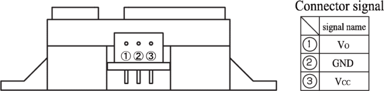
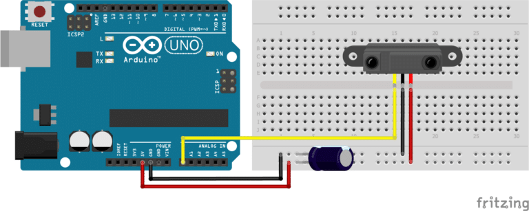

# SHARP GP2Y0A02YK0F + Arduino (20–150 cm)

Sensor infrarrojo de distancia **SHARP GP2Y0A02YK0F** (salida analógica). Este **Tutorial** explica el cableado con Arduino, un código base para leer el sensor, y dos métodos para obtener la distancia en centímetros: **(A)** mediante una **fórmula** (ajustada por calibración) y **(B)** mediante **`map()`**.

> **Rango nominal:** 20–150 cm. Fuera de ese rango la lectura puede ser poco fiable.

---

## Materiales

- 1× SHARP **GP2Y0A02YK0F** (20–150 cm)  
- Arduino (UNO/Nano/etc.)  
- Jumpers  
- **Condensador electrolítico ≥ 10 µF** entre **Vcc** y **GND** cerca del sensor (recomendado para filtrar picos/ruido).

---

## Conexión



| SHARP | Arduino |
|---|---|
| **Vout** | **A0** |
| **GND** | **GND** |
| **VCC** | **5V** |


> Conectar un **condensador de 10 µF o mayor** entre **Vcc** y **GND** lo más cerca del sensor reduce el ruido de la fuente.

---

## Conceptos clave

- La salida es **analógica** (tensión) y **no lineal** respecto a la distancia (**curva decreciente/“potencial negativa”**).  
- Por debajo del mínimo del rango (≈20 cm en el GP2Y0A02) pueden aparecer **ambigüedades** (mismas tensiones para diferentes distancias cortas). Mecánicamente conviene evitar que objetos entren en la “zona ciega”.

---

## Código base: lectura sencilla + promediado

Lee `A0`, aplica un pequeño promedio móvil para reducir ruido y muestra el valor ADC y el voltaje.

```cpp
// GP2Y0A02YK0F + Arduino: lectura base
const uint8_t PIN_SHARP = A0;
const float   VREF      = 5.0;     // referencia ADC (UNO típico)
const int     N_SAMPLES = 20;      // promediado sencillo

void setup() {
  Serial.begin(9600);
}

int readSharpAveraged(uint8_t pin, int n) {
  long acc = 0;
  for (int i = 0; i < n; i++) {
    acc += analogRead(pin);
    delayMicroseconds(200); // separa un poco las muestras
  }
  return (int)(acc / n);
}

void loop() {
  int   adc = readSharpAveraged(PIN_SHARP, N_SAMPLES); // 0..1023
  float v   = (adc * VREF) / 1023.0;                   // voltios aprox.

  Serial.print("ADC: "); Serial.print(adc);
  Serial.print("\tV: "); Serial.println(v, 3);

  delay(50);
}
```

---

## Método A — Distancia por **fórmula (calibración)**

La curva **Voltaje vs Distancia** del GP2Y0A02 es no lineal. La práctica común es **tomar datos** (distancias reales y su ADC/Voltaje) y ajustar una **ley potencial** u otra función (p. ej., potencia, polinómica o racional).

### Pasos recomendados

1. Coloca un objeto plano/blanco a varias distancias dentro de **20–150 cm** (p. ej., cada 10 cm).  
2. Para cada punto, captura el **ADC promedio** (usa el código base).  
3. Ajusta en tu herramienta favorita (Excel, Python, etc.) una función del tipo:

dist_cm≈a⋅(ADC)b+c

o una forma **razón/inversa** (depende de tu ajuste).  
4. Lleva esos **coeficientes** al Arduino.

### Ejemplo de implementación (con coeficientes de ejemplo)

```cpp
// Método A: distancia por fórmula (usa tus coeficientes calibrados)
float distanceCmFromADC(int adc) {
  // Modelo potencial: d = a * (ADC)^b + c
  const float A_COEF = 1.19e6; // <-- EJEMPLO. Reemplaza por tus valores calibrados
  const float B_COEF = -1.176; // <-- EJEMPLO. Reemplaza por tus valores calibrados
  const float C_COEF = -0.0;   // <-- EJEMPLO. Reemplaza por tus valores calibrados

  // Seguridad básica
  adc = constrain(adc, 0, 1023);
  return A_COEF * pow(adc, B_COEF) + C_COEF;
}

void loop() {
  int adc = readSharpAveraged(PIN_SHARP, N_SAMPLES);
  float d = distanceCmFromADC(adc);
  d = constrain(d, 20.0, 150.0);
  Serial.print("Dist (formula): "); Serial.print(d, 1); Serial.println(" cm");
  delay(100);
}
```

---

## Método B — Distancia con **`map()`** (lineal por tramos)

Si necesitas una solución rápida, puedes mapear **linealmente** el rango útil, sabiendo que la relación real **no es lineal**.

### Ejemplo con un único tramo

```cpp
// Método B: distancia con map() en un tramo 20–150 cm
const int   ADC_AT_20CM  = 750; // <-- pon tu medida real
const int   ADC_AT_150CM = 220; // <-- pon tu medida real

int adcToCmByMap(int adc) {
  long cm = map(adc, ADC_AT_20CM, ADC_AT_150CM, 20, 150);
  return (int)constrain(cm, 20, 150);
}

void loop() {
  int adc = readSharpAveraged(PIN_SHARP, N_SAMPLES);
  int d   = adcToCmByMap(adc);
  Serial.print("Dist (map): "); Serial.print(d); Serial.println(" cm");
  delay(100);
}
```

---

## Consejos de uso / precisión

- **Evita** medir por debajo del mínimo (≈20 cm en GP2Y0A02) y por encima de 150 cm.  
- **Promedia** varias lecturas o aplica un **filtro** (media móvil, mediana).  
- Usa el **condensador** cerca del sensor para estabilizar la alimentación.  
- La superficie/reflectividad del objeto afecta la lectura; **calibra** tu montaje.

---
